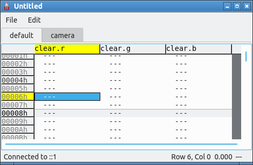

# Installation on Ubuntu

Tested on Lubuntu Eoan (19.04) using `bash` as the shell.

1. Install dependencies:

        sudo apt install --install-suggests libsdl-gfx1.2-dev
        sudo apt install qt5-default coreutils build-essential elementary-icon-theme

2. Install BASS:

   - Visit <http://www.un4seen.com/> and click "Download"
     next to the penguin at the top of the page.
     Or, if you have `curl` installed,

         $ curl -O http://www.un4seen.com/files/bass24-linux.zip

   - Unzip the downloaded bass24-linux:

         $ unzip -d bass24 bass24-linux.zip

   - Copy the files.  Assuming `$rocket` holds the path to your Rocket
     directory:

         $ mkdir $rocket/examples/{lib,include}
         $ cp bass24/x64/libbass.so $rocket/examples/lib    # or ./libbass.so for 32-bit x86
         $ cp bass24/bass.h $rocket/examples/include

3. Build the editor.  In your Rocket directory, run `make`.  You should then
   be able to run `./editor/editor &` and get a "Rocket Editor" window with
   no data.

4. Build the example.  Still in your Rocket directory, run

         $ make examples/example_bass

   This will build the example for communication with the editor.

5. Test the example.  Still with the editor open, run:

         $ cd examples
         $ LD_LIBRARY_PATH="$(realpath lib):$LD_LIBRARY_PATH" ./example_bass &
             # ^ This is so the system can find libbass.so

   You will see an "Unnamed Window" open.  Also, in the editor,
   data columns will appear:

   

At this point, you are ready to go!  You can add data values in the editor
to control the example.
